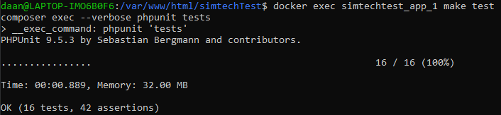

<h2>Приложение admin-panel</h2>  

<b>Стэк:</b>  
 - PHP 7.4
 - Laravel 8.33.1
 - MySQL
 - TALL-stack
 - JavaScript (jquery)
 - Docker

<b>Выполнено:</b>
- Frontend на Tall-stack и немного JS (jquery)
- регистрация пользователей
- вычисление суммы последовательности чисел Фибоначчи
- получение значения DNS
- отображение (только для админов) всех логов запросов и ответов
- очистка всех логов (только для админов)
- Feature-тесты API

<b>Развертывание:</b>
- подготовлен Dockerfile и docker-compose.yml
- из корневого каталога проекта выполнить:
    - docker-compose build  
    - docker-copmose up -d  
- когда контейнер будет собран, при первом запуске приложения нужно выполнить:
    - docker exec name_container php artisan migrate  
    - docker exec name_container php artisan passport:install  
      Работа приложения в контейнере проверена в WSL2 (Debian), в том числе тесты:  
      
      
<b>Дополнительно сделано: </b>
 - Makefile. (make test - запустить тесты; из корневого каталога проекта)

<b>В самом приложении:</b>  
Изначально нужно зарегестрироваться (правый верхний угол - Register).
Кнопка 'Register as admin' отключена.
После регистрации нужно выйти (Logout) из админ-панели и уже зайти (Sign in) под созданным пользователем.
Если выбрать Sign in as admin то будут доступны управление логами (просмотр и очистка).
Если выбрать просто Sign in (режим пользователя) то управление логами недоступно.

<b>Замечания:</b>  
Особо на Frontend не упирал, есть конечно недочеты.  

Регистрация и аутентифкация пользователей сделаны таким образом чтобы связать API и Frontend. То есть чтобы по роутам api можно было
взаимодействовать с элементами frontend'а.  

Если пользователя создавать через api/admin/register или api/register - то так все тоже работает. Просто пока не смог решить (чтобы уже время
не тянуть) как увязать регистрацию через frontend (обычная регистрация) с регистрацией по route api.
Если под обычным юзером (Sign in) попытаться просмотреть логи или очистить их, то в alert (JS) вываливается Exception (не успел поправить).  

С Feature-тестами тоже впервые работаю. Пришлось в тестах сначала создавать пользователя (и создавать в каждом тесте). Эти пользователи
заносятся в таблицу users. Чтобы они там не оставались, удаляю их через условие whereNotNull('email_verified_at'), так как создаются они с заполнением этого столбца.
А у пользователей зарегестрированных в ручную этот столбец пуст (ну пока вот такое решиние, на данный момент по другому не знаю как).
